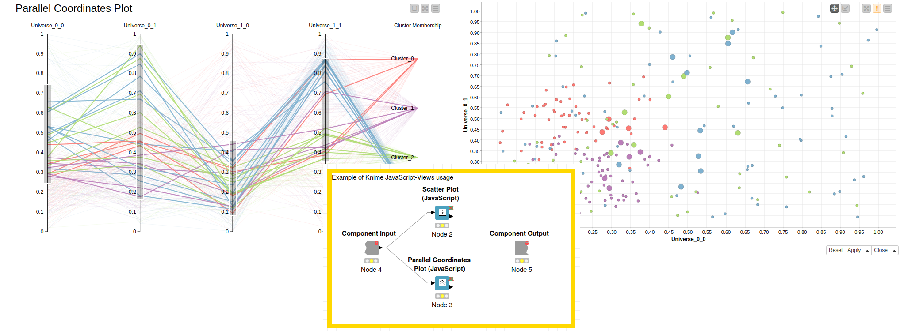

# KNIME® JS Base

This repository is maintained by the [KNIME UI Extensions Development Team](mailto:team-ui-extensions@knime.com).

This repository contains the source code of [KNIME Analytics Platform](http://www.knime.org) JavaScript Nodes. In the this repository all the base nodes containing JavaScript visualizations are located.

### Overview
Contained nodes:

* CSS Editor
* Decision Tree View
* Generic Java Script View
* Paged Table View
* Plotter Views
  * Lift Chart
  * Line Chart
  * Roc Chart
  * Scatter Plot Chart
* Table View
* Tagcloud View
* Configuration Nodes
    * Filter
        * Column Filter Configuration
        * Nominal Row Filter Configuration
    * Input
        * Boolean Configuration
        * Credentials Configuration
        * Date&Time Configuration
        * Double Configuration
        * File Chooser Configuration
        * File Upload Configuration
        * Integer Configuration
        * List Box Configuration
        * Integer Slider Configuration
        * String Configuration
    * Selection
        * Column Selection Configuration
        * Multiple Selection Configuration
        * Single Selection Configuration
        * Value Selection Configuration
* Output Nodes 
    * File Download
    * Image Output
    * Text Output
* Widget Nodes
    * Filter
        * Column Filter Widget
        * Nominal Row Filter Widget
        * Interactive Value Filter Widget
        * Interactive Range Slider Filter Widget
    * Input
        * Boolean Widget
        * Credentials Widget
        * Date&Time Widget
        * Double Widget
        * File Chooser Widget
        * File Upload Widget
        * Integer Widget
        * List Box Widget
        * Integer Slider Widget
        * String Widget
    * Selection
        * Column Selection Widget
        * Multiple Selection Widget
        * Single Selection Widget
        * Value Selection Widget
* QuickForm Nodes (soon to be deprecated)
    * Filter
        * Column Filter
        * Nominal Row Filter
        * Value Filter Definition
        * Range Slider Filter Definition
    * Input
        * Boolean Input
        * Date&Time Input
        * Double Input
        * File Chooser
        * File Upload
        * Integer Input
        * List Box Input
        * Slider Input
        * String Input
    * Selection
        * Column Selection
        * Multiple Selection
        * Single Selection
        * Value Selection

    

### User Guide
Visit the [KNIME Visualization Guide](https://www.knime.com/nodeguide/visualization/javascript) for usage examples

### Content

* _org.knime.dynamic.js.*_: Dynamically created JavaScript nodes
* _org.knime.js.quickforms*_: Configuration, Widget and Quickform nodes
* _org.knime.js.views*_: Regular JavaScript view nodes

### Development
Instructions for how to develop extensions for KNIME Analytics Platform can be found in the _knime-sdk-setup_ repository on [BitBucket](https://bitbucket.org/KNIME/knime-sdk-setup) or [GitHub](http://github.com/knime/knime-sdk-setup).

### Join the Community!
* [KNIME Forum](https://tech.knime.org/forum)
